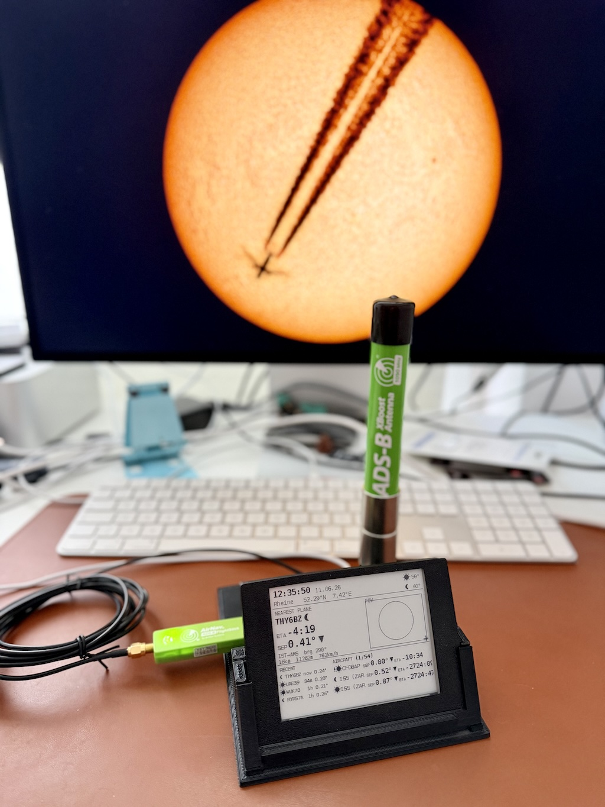

# sun-moon-transit-predictor

Predicts and detects aircraft — and satellites (**ISS, Hubble, Tiangong**) —
transiting across the **Sun and Moon disc** from a fixed observer location, so the
camera at the telescope can be armed in time. End-to-end on a single **Raspberry Pi 5** with `dump1090-fa`, a
browser UI, an optional **e-paper panel + piezo buzzer**, and two-stage Pushover
alerts (early candidate → precise T-minus).




```
[ADS-B antenna] → [dump1090-fa] → aircraft.json ──poll 2 s──▶ [stp service]
                                                               tracker   · 300 s linear extrapolation
                                                               geometry  · topocentric Az/El (Sun/Moon)
                                                               notifier  · 3-stage Pushover
                                                               store     · SQLite history + learning
                                                               server    · /api/* + web UI on :8081
                                                               sharpcap  · optional live capture trigger
```

---

## ⚡ Quick start

On a fresh **Raspberry Pi OS Lite (64-bit)**, one line installs everything
(`dump1090-fa` + its RTL-SDR driver, Node.js, the predictor service, the
nightly auto-update):

```bash
curl -fsSL https://raw.githubusercontent.com/joergs-git/sun-moon-transit-predictor/main/scripts/bootstrap-pi5.sh | bash
```

Then open **`http://<your-pi-ip>:8081/`**, set your coordinates in ⚙ Settings,
and you're tracking. Plug in an RTL-SDR + 1090 MHz antenna for data.

> Already have an ADS-B feed (PiAware, a network `aircraft.json`)? Add
> `... bootstrap-pi5.sh | bash -s -- --no-dump1090` and point `adsb.url` at it.

Full walkthrough → **[Setup wiki](https://github.com/joergs-git/sun-moon-transit-predictor/wiki/Setup)**.

---

## 📚 Documentation

The full documentation now lives in the **[Wiki](https://github.com/joergs-git/sun-moon-transit-predictor/wiki)** — start at the
**[Home / table of contents](https://github.com/joergs-git/sun-moon-transit-predictor/wiki/Home)**.

### 🚀 [Setup — install & run](https://github.com/joergs-git/sun-moon-transit-predictor/wiki/Setup)
Quick start · hardware & ADS-B receiver (bill of materials) · install on the Pi 5 · systemd service control · updating.

### 🛰 [Usage — alerts, web UI, display](https://github.com/joergs-git/sun-moon-transit-predictor/wiki/Usage)
Web UI & FOV preview · e-paper display + buzzer · Pushover setup & alert learning · satellite transits (ISS, Hubble, Tiangong).

### ⚙️ [Advanced — watchlist, triggers, internals](https://github.com/joergs-git/sun-moon-transit-predictor/wiki/Advanced)
Predictive 24 h watchlist · OpenSky schedule augmentation · SharpCap capture trigger · candidate lifecycle · how the prediction works · end-to-end pipeline.

### 📚 [Reference — config, API, limits, trivia](https://github.com/joergs-git/sun-moon-transit-predictor/wiki/Reference)
`observer.json` / `service.json` config · HTTP API · file locations & project layout · development & tests · assumptions & limitations · statistical trivia.

### In-repo docs
- **[display/README.md](display/README.md)** — e-paper panel + buzzer (layout, wiring, signals).
- **[3D-Prints/README.md](3D-Prints/README.md)** — printable Pi 5 / e-paper stand + buzzer wiring + parts list.
- **[MILESTONES.md](MILESTONES.md)** — version history.

---

## At a glance

- Single **Raspberry Pi 5**, ~5 W, browser-administered, runs unattended for months.
- **Offline** geometry (SGP4 for satellites — ISS, Hubble, Tiangong — `astronomy-engine` for Sun/Moon) — no cloud needed for prediction.
- Optional **e-paper panel** (browserless readout) + **piezo buzzer** (audible countdown), both configured from the web UI.
- Auto-updates nightly from `main`; personal config (`observer.json`, `service.json`, `data/`) is never overwritten.

## License

TBD.
